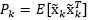

# 卡尔曼滤波原理

卡尔曼滤波主要用于获取最真实的数据，是一种状态最优估计方法.
在一些应用中，如导航，需要获取当前位置以及当前速度，这个一般是通过传感器来获取。但是由于传感器精度等环境因素，获取的数据并不能精确表示当前的状态，预测也不是很完美。kalmanfilter则是通过将可用的信息，根据其本身的噪声，分配一定的权重，就能得到一个比任何自身估计更好的结果。
但实际中由于理论上只适用于线性系统的经典卡尔曼滤波器不适合于大多数情况，于是出现了EKF(Extended Kalman filter)和UKF(Unscented Kalman Filter)

协方差：两个变量总体误差的期望，度量两个变量线性相关性程度
随机变量X和Y的协方差计算为：
 
 $E(X)=\mu$
  
 $E(Y)=\nu$
 
协方差为：
 
${\displaystyle \operatorname {cov} (X,Y)=\operatorname {E} ((X-\mu )(Y-\nu ))=\operatorname {E} (X\cdot Y)-\mu \nu .}$
 
协方差矩阵：数据中两两变量的协方差组成,其i,j位置的元素是第i个与第j个随机变量之间的协方差
 
${\displaystyle \Sigma =\mathrm {E} \left[\left(\mathbf {X} -\mathrm {E} [\mathbf {X} ]\right)\left(\mathbf {X} -\mathrm {E} [\mathbf {X} ]\right)^{\rm {T}}\right]}
{\displaystyle ={\begin{bmatrix}\mathrm {E} [(X_{1}-\mu _{1})(X_{1}-\mu _{1})]&\mathrm {E} [(X_{1}-\mu _{1})(X_{2}-\mu _{2})]&\cdots &\mathrm {E} [(X_{1}-\mu _{1})(X_{n}-\mu _{n})]\\\\\mathrm {E} [(X_{2}-\mu _{2})(X_{1}-\mu _{1})]&\mathrm {E} [(X_{2}-\mu _{2})(X_{2}-\mu _{2})]&\cdots &\mathrm {E} [(X_{2}-\mu _{2})(X_{n}-\mu _{n})]\\\\\vdots &\vdots &\ddots &\vdots \\\\\mathrm {E} [(X_{n}-\mu _{n})(X_{1}-\mu _{1})]&\mathrm {E} [(X_{n}-\mu _{n})(X_{2}-\mu _{2})]&\cdots &\mathrm {E} [(X_{n}-\mu _{n})(X_{n}-\mu _{n})]\end{bmatrix}}}=
\begin{bmatrix}
 \mathrm{E}[(X_1 - \mu_1)(X_1 - \mu_1)] & \mathrm{E}[(X_1 - \mu_1)(X_2 - \mu_2)] & \cdots & \mathrm{E}[(X_1 - \mu_1)(X_n - \mu_n)] \\ \\
 \mathrm{E}[(X_2 - \mu_2)(X_1 - \mu_1)] & \mathrm{E}[(X_2 - \mu_2)(X_2 - \mu_2)] & \cdots & \mathrm{E}[(X_2 - \mu_2)(X_n - \mu_n)] \\ \\
 \vdots & \vdots & \ddots & \vdots \\ \\
 \mathrm{E}[(X_n - \mu_n)(X_1 - \mu_1)] & \mathrm{E}[(X_n - \mu_n)(X_2 - \mu_2)] & \cdots & \mathrm{E}[(X_n - \mu_n)(X_n - \mu_n)]
\end{bmatrix}$
 
 

## 1.Kalmanfilter 
动态系统的基本模型如下：

假设在k和k-1时刻，一离散线性动态系统的模型如下所示： 
状态方程：
$x(k)=F \bullet x(k-1) + B \bullet u(k-1) + w(k-1)$
 
观测方程: 
$z(k)=H \bullet x(k) + v(k)$
 
x(k)是k时刻系统的状态，u(k)是k时刻对系统的控制量。F和B是系统参数，通常为转移矩阵
 
z(k)是k时刻的观测值，H是观测系统的参数，通常是矩阵。w(k)和v(k)分别表示过程和观测的噪声，且为高斯白噪声，协方差分别为Q和R。
 
卡尔曼滤波器的操作包含两个阶段：预测和更新
<li>在预测阶段，滤波器使用上一状态的估计，做出对当前状态的估计
<li>在更新阶段，滤波器利用对当亲状态的观测值优化在预测状态的预测值，以获得一个更精确的新估计值。
 
  

### 1. kalmanfilter五个公式

状态方程：$x_{k}=A \bullet x_{k-1} + w_{k-1}$
 
观测方程：$Z_{k}=H \bullet x_{k} + v_{k}$

在无噪声下预测

观测新信息反映了预测噪声w和观测噪声v对状态的综合影响

其中仅有卡尔曼增益$K_{K}$未知

### 2. 求卡尔曼增益
首先看误差协方差矩阵： 

 
卡尔曼增益应该使误差协方差矩阵$P_{k}$最小

在无噪声下，上式变为： 

## kalmanfilter Algorithm
状态方程：$x_{k}=Fx_{k-1}+Bu_{k-1}+w_{k-1}$
 
测量方程：$z_{k}=Hx_{k}+v_{k}$

### 预测阶段：
预测状态估计：${\hat{x}^{-}_{k}}=F\hat{x}^{+}_{k-1} + Bu_{k-1}$
 
预测误差协方差：$P^{-}_{k}=FP^{+}_{k-1}F^{T}+Q$

### 更新阶段：
测量残留：${\widetilde{y}_{k}}=z_{k}-H \hat{x}^{-}_{k}$
 
Kalman 增益：$K_{k}=P^{-}_{k}H^{T}(R+HP^{-}_{k}H^{T})^{-1}$
 
更新状态估计：${\hat{x}^{+}_{k}}=\hat{x}^{-}_{k}+K_{k}\widetilde{y}$
 
更新误差协方差：$P^{+}_{k}=(I-K_{k}H)P^{-}_{k}$
 
其中
  
$Q=E(w_{m}w^{T}_{m})$
 
$R=E(v_{m}v^{T}_{m})$
 
参考 
https://www.guyuehome.com/15356

# Extended Kalman filter
对于非线性的动态系统， 
$x_{k}=f(x_{k-1},u_{k-1})+w_{k-1}$ 
 
$z_{k-1}=h(x_{k})+v_{k}$
 
$F_{k-1}=\frac{\partial{f}}{\partial{x}}|_{\hat{x}^{+}_{k},u_{k-1}}$
 
$h_{k}=\frac{\partial{h}}{\partial{x}}|_{\hat{x}^{-}_{k}}$

### 预测阶段：
$\hat{x}^{-}_{k}=f({\hat{x}^{+}_{k},u_{k-1}})$
 
$P^{-}_{k}=F_{k-1}P^{+}_{k-1}F^{T}_{k-1}+Q$

### 更新阶段：
测量残留：${\widetilde{y}_{k}}=z_{k}-h(\hat{x}^{-}_{k})$
 
Kalman 增益：$K_{k}=P^{-}_{k}H^{T}_{k}(R+HP^{-}_{k}H^{T}_{k})^{-1}$
 
更新状态估计：${\hat{x}^{+}_{k}}=\hat{x}^{-}_{k}+K_{k}\widetilde{y}$
 
更新误差协方差：$P^{+}_{k}=(I-K_{k}H_{k})P^{-}_{k}$
 

# Unscented Kalman Filter